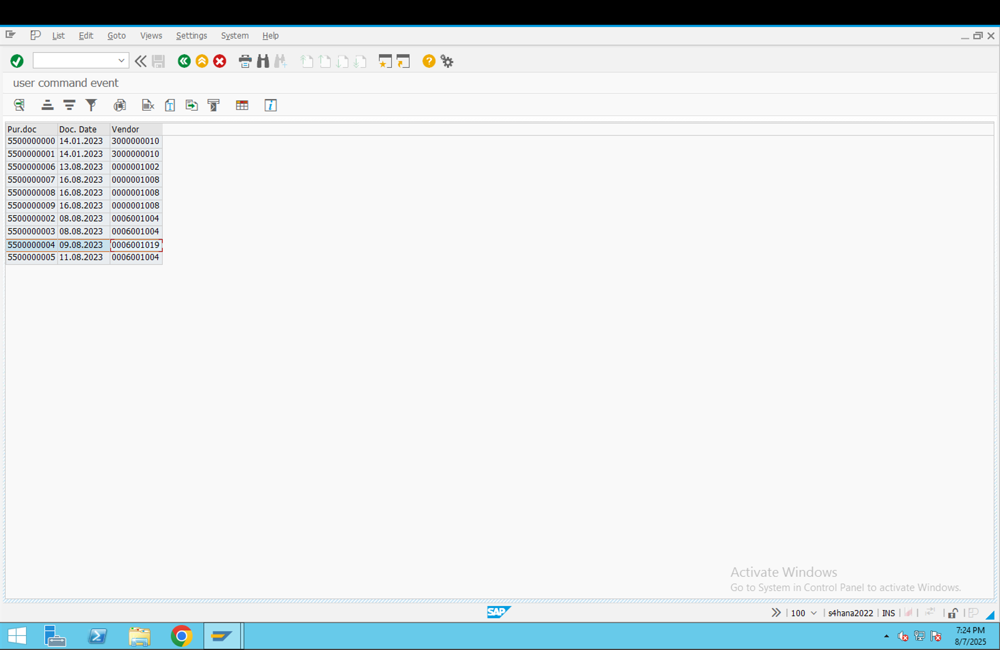
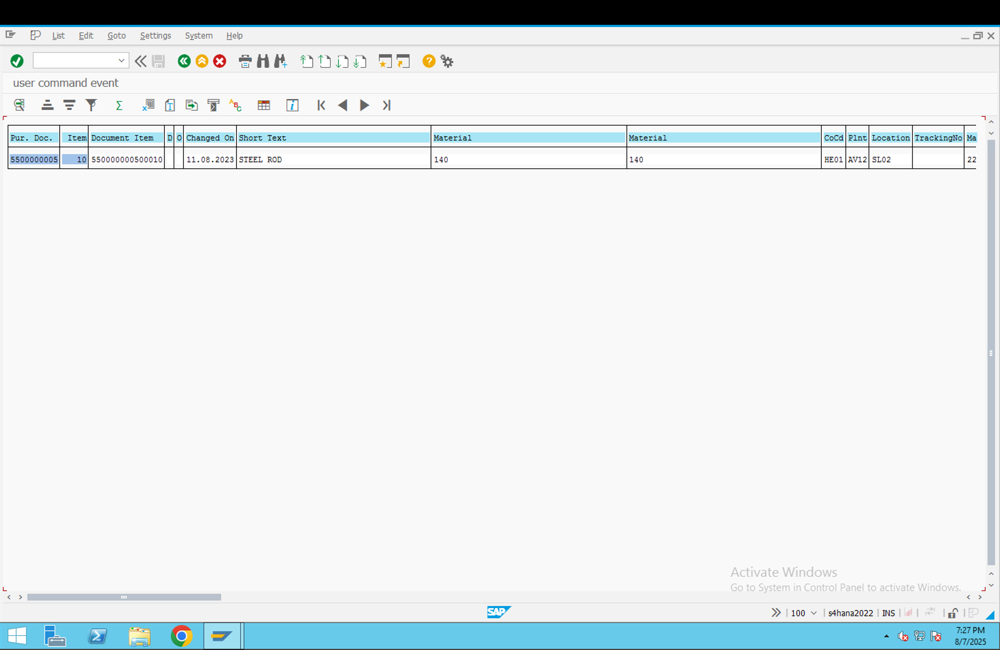
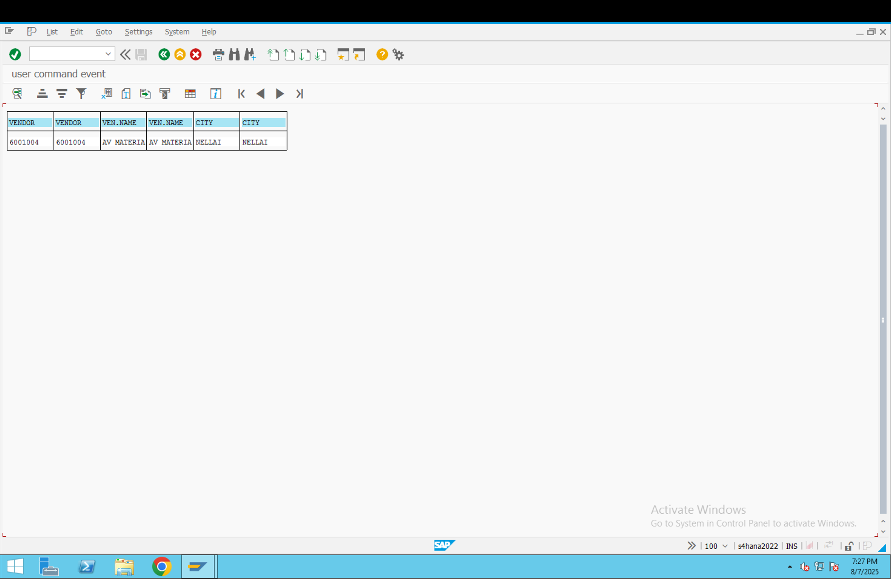

*&---------------------------------------------------------------------*
*& Report ZRS70_ALV_USER_COMM_EVENT1
*&---------------------------------------------------------------------*
*Object :Based on the given purchase doc numbers, to display the purchase document numbers, document
*dates & vendor numbers by using ALV . If the user clicks on any purchasing document number only
*then we display the all the purchasing document item details by using ALV,if the user clicks on any
*vendor number only then we display the vendor details(LIFNR NAME1 ORT01)
*&

    REPORT zrs70_alv_user_comm_event.
    
    DATA v1 TYPE lfa1-lifnr.
    TYPE-POOLS slis.
    TABLES ekko.
    SELECT-OPTIONS s_ebeln FOR ekko-ebeln.
    
    *DECLARE DATA INTERNAL TABLE
    TYPES : BEGIN OF ty_ekko,
    ebeln TYPE ekko-ebeln,
    bedat TYPE ekko-bedat,
    lifnr TYPE ekko-lifnr,
    END OF ty_ekko.
    
    DATA : it_ekko TYPE TABLE OF ty_ekko.
    
    *DECLARE INTERNAL TABLE FOR EKPO WITH ALL FIELDS
    DATA : it_ekpo TYPE TABLE OF ekpo.
    
    *DECLARE INTERNAL TABLE FOR LFA1.
    TYPES : BEGIN OF ty_lfa1,
    lifnr TYPE lfa1-lifnr,
    name1 TYPE lfa1-name1,
    ort01 TYPE lfa1-ort01,
    END OF ty_lfa1.
    
    DATA : it_lfa1 TYPE TABLE OF ty_lfa1.
    
    *DECLARE FIELDCATELOG FOR EKKO.
    DATA : it_fcat TYPE slis_t_fieldcat_alv,
    wa_fcat LIKE LINE OF it_fcat.
    
    *DECLARE FIELDCATELOG FOR LFA1.
    DATA : it_fcat1 TYPE slis_t_fieldcat_alv,
    wa_fcat1 LIKE LINE OF it_fcat.
    
    *DECLARE EVENT INTERNAL TABLE
    DATA : it_event TYPE slis_t_event,
    wa_event LIKE LINE OF it_event.
    
    *FILLING THE DATA INTERNAL TABLE
    SELECT ebeln bedat lifnr FROM ekko INTO TABLE it_ekko WHERE ebeln IN s_ebeln.
    
    wa_fcat-fieldname = 'EBELN'.
    wa_fcat-col_pos = '1'.
    wa_fcat-seltext_m = 'Pur.doc'.
    APPEND wa_fcat TO it_fcat.
    CLEAR wa_fcat.
    
    wa_fcat-fieldname = 'BEDAT'.
    wa_fcat-col_pos = '2'.
    *WA_FCAT-SELTEXT_M = 'Doc.date'.
    wa_fcat-ref_fieldname = 'BEDAT'.
    wa_fcat-ref_tabname = 'EKKO'.
    APPEND wa_fcat TO it_fcat.
    CLEAR wa_fcat.
    
    wa_fcat-fieldname = 'LIFNR'.
    wa_fcat-col_pos = '3'.
    wa_fcat-seltext_m = 'Vendor'.
    APPEND wa_fcat TO it_fcat.
    CLEAR wa_fcat.
    
    wa_event-name = 'USER_COMMAND'.
    wa_event-form = 'UC'.
    APPEND wa_event TO it_event.
    
    CALL FUNCTION 'REUSE_ALV_GRID_DISPLAY'
    EXPORTING
    i_callback_program = 'ZRS70_ALV_USER_COMM_EVENT'
    it_fieldcat        = it_fcat
    it_events          = it_event
    TABLES
    t_outtab           = it_ekko.
    
    FORM uc USING a LIKE sy-ucomm b TYPE slis_selfield.

    IF b-fieldname = 'EBELN'.

    SELECT * FROM ekpo INTO TABLE it_ekpo WHERE ebeln = b-value.

    CALL FUNCTION 'REUSE_ALV_LIST_DISPLAY'
      EXPORTING
        i_structure_name = 'EKPO'
      TABLES
        t_outtab         = it_ekpo.

    ELSEIF b-fieldname = 'LIFNR'.

    DATA v1 TYPE lfa1-lifnr.
    v1 = b-value.

    SELECT lifnr name1 ort01 FROM lfa1 INTO TABLE it_lfa1 WHERE lifnr = v1.

    wa_fcat1-fieldname = 'LIFNR'.
    wa_fcat1-col_pos   = '1'.
    wa_fcat1-seltext_m = 'VENDOR'.
    APPEND wa_fcat1 TO it_fcat1.

    wa_fcat1-fieldname = 'NAME1'.
    wa_fcat1-col_pos   = '2'.
    wa_fcat1-seltext_m = 'VEN.NAME'.
    APPEND wa_fcat1 TO it_fcat1.

    wa_fcat1-fieldname = 'ORT01'.
    wa_fcat1-col_pos   = '3'.
    wa_fcat1-seltext_m = 'CITY'.
    APPEND wa_fcat1 TO it_fcat1.

    CALL FUNCTION 'REUSE_ALV_LIST_DISPLAY'
      EXPORTING
        it_fieldcat = it_fcat1
      TABLES
        t_outtab    = it_lfa1.

    ENDIF.

    ENDFORM.

output:

if the user clicks on any purchase document number:

if the user clicks on any vendor number:

