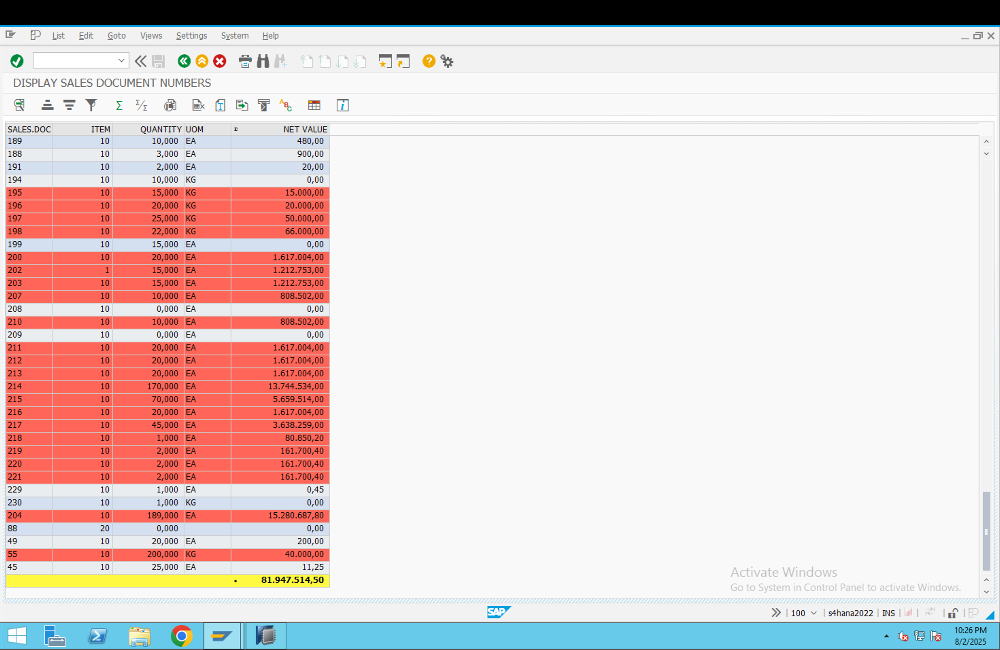

# ABAP Report: ZRS70_DIS_SALES_DOC_NO_ALV2

Objective:
To develop an ABAP report that fetches sales document item data from the VBAP table based on user-provided document numbers and displays the results in an ALV grid. The ALV output should include row-wise color highlighting for records where the net value exceeds a certain threshold (₹12,000), and allow summation of net values.


```abap
REPORT zrs70_dis_sales_doc_no_alv2.

TABLES: vbap.

* Selection screen
SELECT-OPTIONS: s_vbeln FOR vbap-vbeln.

* Define structure and internal table
TYPES: BEGIN OF ty_vbap,
         vbeln  TYPE vbap-vbeln,
         posnr  TYPE vbap-posnr,
         kwmeng TYPE vbap-kwmeng,
         meins  TYPE vbap-meins,
         netwr  TYPE vbap-netwr,
         col(4) TYPE c, "Field for ALV row color
       END OF ty_vbap.

DATA: wa_vbap TYPE ty_vbap,
      it_vbap TYPE TABLE OF ty_vbap.

* ALV layout and field catalog
DATA: wa_layout TYPE slis_layout_alv,
      wa_fcat   TYPE slis_fieldcat_alv,
      it_fcat   TYPE slis_t_fieldcat_alv.

START-OF-SELECTION.

  * Fetch data from VBAP
  SELECT vbeln
         posnr
         kwmeng
         meins
         netwr
    FROM vbap
    INTO TABLE it_vbap
    WHERE vbeln IN s_vbeln.

  * Set color for rows where net value > 12000
  LOOP AT it_vbap INTO wa_vbap WHERE netwr > 12000.
    wa_vbap-col = 'C610'. "Light red shade
    MODIFY it_vbap FROM wa_vbap TRANSPORTING col.
  ENDLOOP.

  * ALV Layout settings
  wa_layout-info_fieldname    = 'COL'.
  wa_layout-colwidth_optimize = 'X'.
  wa_layout-zebra             = 'X'.

  * Fill field catalog
  CLEAR wa_fcat.
  wa_fcat-fieldname = 'VBELN'.
  wa_fcat-col_pos   = 1.
  wa_fcat-seltext_m = 'Sales Doc'.
  wa_fcat-no_zero   = 'X'.
  APPEND wa_fcat TO it_fcat.

  CLEAR wa_fcat.
  wa_fcat-fieldname = 'POSNR'.
  wa_fcat-col_pos   = 2.
  wa_fcat-seltext_m = 'Item'.
  APPEND wa_fcat TO it_fcat.

  CLEAR wa_fcat.
  wa_fcat-fieldname = 'KWMENG'.
  wa_fcat-col_pos   = 3.
  wa_fcat-seltext_m = 'Quantity'.
  APPEND wa_fcat TO it_fcat.

  CLEAR wa_fcat.
  wa_fcat-fieldname = 'MEINS'.
  wa_fcat-col_pos   = 4.
  wa_fcat-seltext_m = 'UOM'.
  APPEND wa_fcat TO it_fcat.

  CLEAR wa_fcat.
  wa_fcat-fieldname = 'NETWR'.
  wa_fcat-col_pos   = 5.
  wa_fcat-seltext_m = 'Net Value'.
  wa_fcat-do_sum    = 'X'.
  APPEND wa_fcat TO it_fcat.

END-OF-SELECTION.

  * Display ALV output
  CALL FUNCTION 'REUSE_ALV_GRID_DISPLAY'
    EXPORTING
      is_layout   = wa_layout
      it_fieldcat = it_fcat
    TABLES
      t_outtab    = it_vbap.


